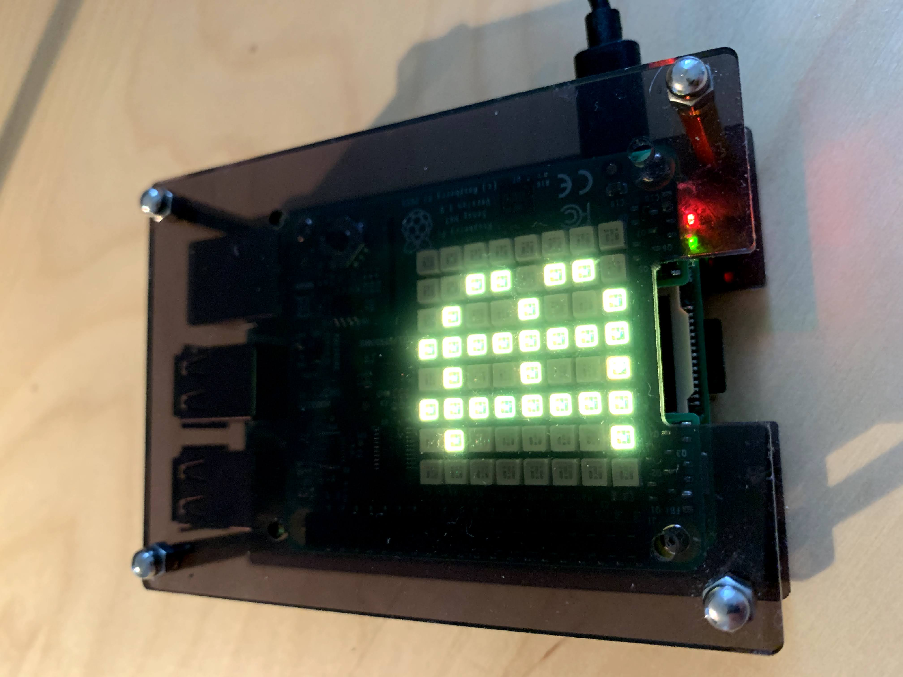
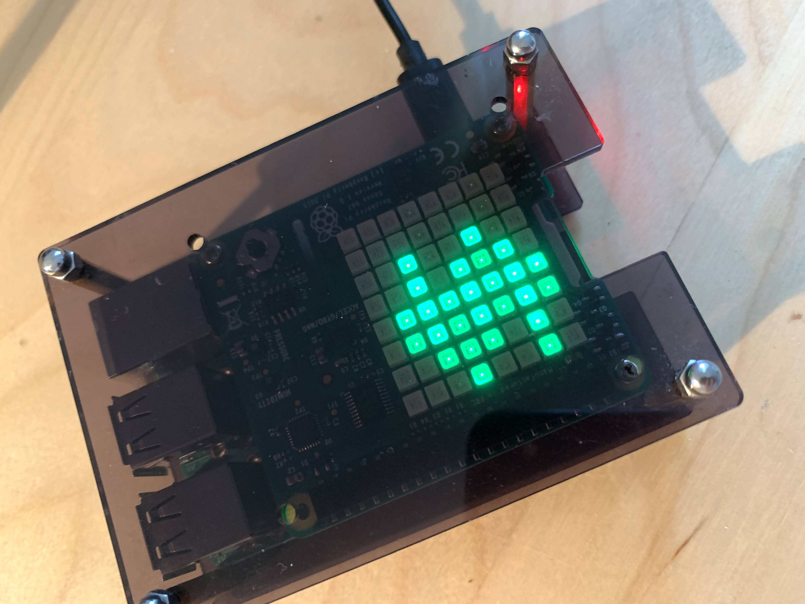
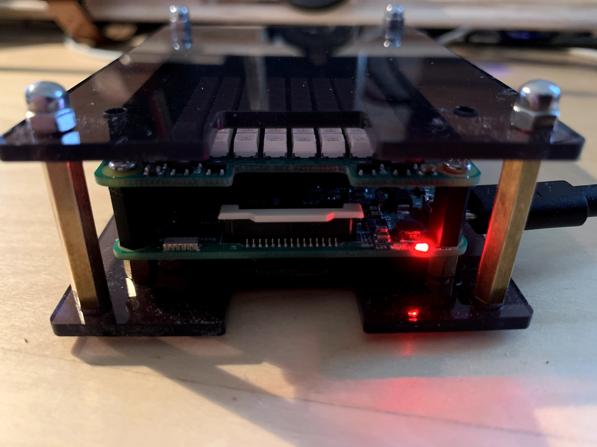
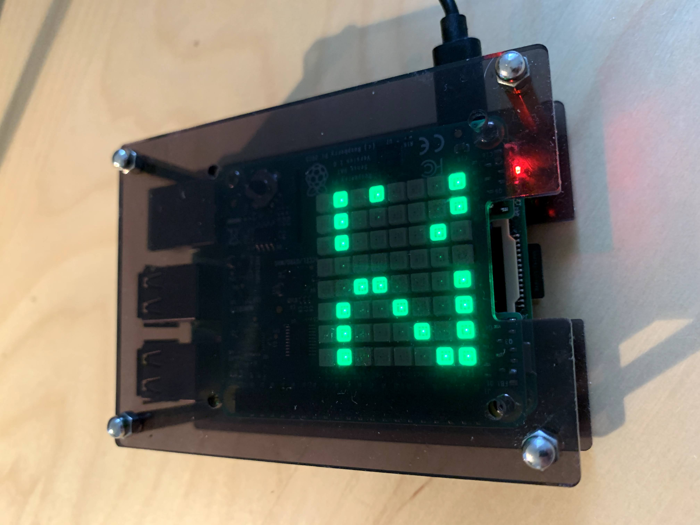

# BTCSenseHat
Python script to check BTC / USD last price and show it on a raspberry pi Sense Hat

Get sense hat: 
Get Raspberry Pi 

1. Install sense hat

sudo apt update
sudo apt install senese-hat
sudo reboot

2. Install websockets dependecies

pip3 install websockets

3. Put it on    /home/'user'/    directory

python3 

